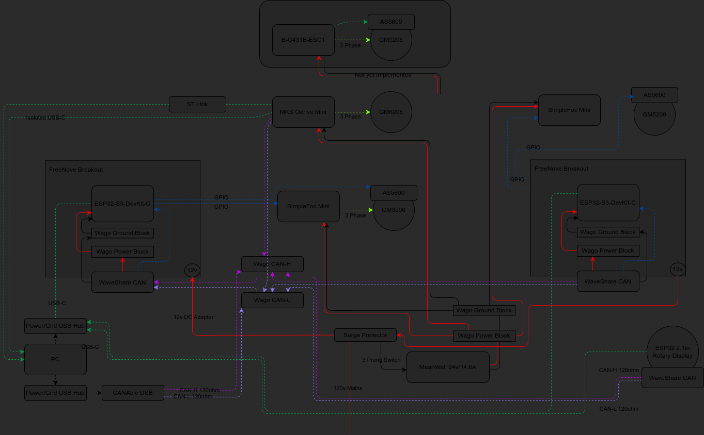
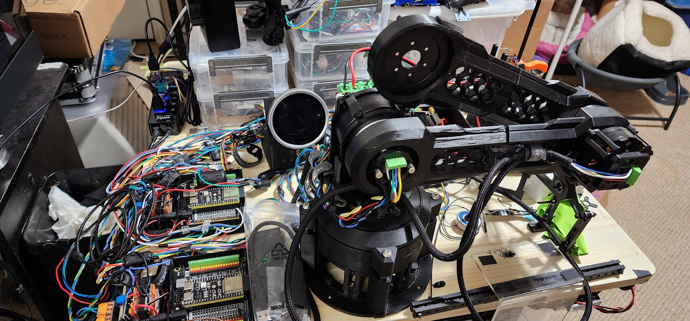
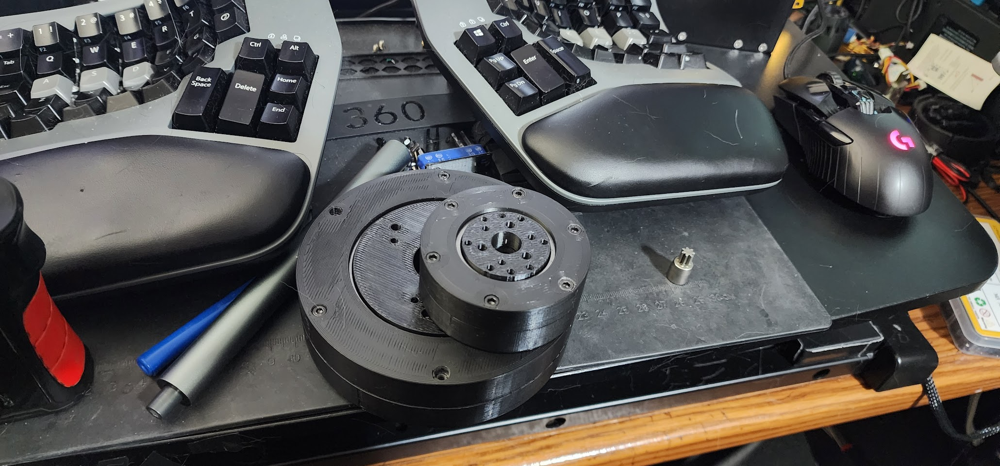

# XDrive Mini FOC

A Field-Oriented Control (FOC) motor control system for ESP32 and STM32-based motor controllers, with CAN bus communication for coordinated motion control.

<div style="width: 60%; height: 60%">



</div>

<div style="width: 60%; height: 60%">



</div>

<div style="width: 60%; height: 60%">



</div>

## Project Overview

This project implements advanced motor control for various hardware platforms using the SimpleFOC library. It supports multiple controller and motor driver combinations, including:

- ESP32-S3 controller
- B-G431B-ESC1 motor driver
- XDrive Mini platform
- ODESC motor driver

The system is designed for precise position and velocity control with support for multiple motors communicating over CAN bus.

## Features

- Field-Oriented Control (FOC) for smooth and efficient motor control
- Multi-motor support with coordinated movement
- CAN bus communication between controllers
- Position and velocity control with configurable limits
- Support for various magnetic sensors (AS5600, MT6701)
- Runtime configuration via serial commands
- Endstop detection for safety
- Velocity ramping for smoother motion profiles

## Hardware Support

| Board | MCU | Description |
|-------|-----|-------------|
| ESP32-S3 | ESP32-S3 | Main controller with CAN support |
| B-G431B-ESC1 | STM32G431 | Motor driver with current sensing |
| XDrive Mini | STM32F405RG | Integrated motor controller |

## Supported Motors

The system supports various motors with different pole pairs configurations:

- GBM520875T (11 pole pairs)
- GM6208 (14 pole pairs)
- EP8308 (20 pole pairs)

## Getting Started

### Prerequisites

- PlatformIO IDE or CLI
- Required libraries (installed automatically by PlatformIO):
  - SimpleFOC 2.3.3+
  - SimpleCAN
  - Arduino-timer

### Building and Flashing

The project uses [just](https://github.com/casey/just) for managing build and flash commands:

```bash
# Build for a specific device
just build esp_controller

# Build all supported devices
just build-all

# Upload to a specific device
just upload esp_controller

# Upload and monitor a device
just upload-monitor esp_controller
```

Available device targets:
- `esp_controller` - ESP32-S3 controller
- `bg431besc1` - B-G431B-ESC1 motor driver
- `bg431besc2` - Second B-G431B-ESC1 motor driver
- `xdrive` - XDrive Mini controller
- `odesc_0` - ODESC motor driver

### Configuration

The project is configured through `platformio.ini`. Key configuration parameters include:

- Motor pole pairs
- Voltage limits
- Current limits
- Encoder type
- CAN bus parameters
- Position limits

## Project Structure

- `src/` - Source code for different controller platforms
  - `_esp32_controller/` - ESP32 controller code
  - `_bg431esc1/` - B-G431B-ESC1 motor driver code
  - `_xdrive/` - XDrive Mini controller code
  - `can/` - CAN bus communication code
  - `Helpers/` - Utility functions
  - `TrapPlanner/` - Trajectory planning

## CAN Bus Communication

The system uses CAN bus for communication between controllers. The protocol supports:

- Real-time position and velocity control
- Status reporting
- Coordinated movement
- Endstop detection and handling

## Usage Examples

### Set Motor Position

To set a motor position via serial command:

```
M0 T10
```

This sets motor 0 to position 10 degrees.

### Adjust Velocity Limit

To adjust the velocity limit:

```
V20
```

This sets the velocity limit to 20 rad/s.

## License

This project is open-source software. Please refer to the license file for more information.

## Contributing

Contributions to this project are welcome. Please follow standard coding conventions and submit pull requests for review.
